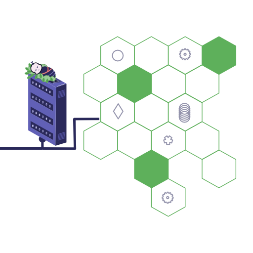

# Baby DB

A easy-to-use, robust, file-based DB for Node. Acts as an append-only store for objects.



## Motivation

When writing NodeJs projects I often find I need an easy-to-use, understandable, yet robust database that I can throw into my project without needing to install another database server and configure a connection etc.

What I needed was a dead simple library that I could plug into any project and that would:

1. Keep data persisted safely
2. Be easy to examine & understand
3. Be easy to backup
4. Be able to scale up reasonably well for small to mid-sized projects.

And so **Baby DB** was born.

## How to Use Baby DB

**Baby DB** stores data in an [append only](https://en.wikipedia.org/wiki/Append-only) log file. This makes it almost impossible to lose data (except if the underlying hardware fails). It’s also a very flexible way to store data - it’s easy to add fields, change the schema and so on by upgrading the processor.

Each instance requires us to pass in a “processor” that consumes each record and aggregates or stores it for use by the rest of the system.  **Baby DB** itself streams the data records so it has very low memory overhead.

To keep things simple, while you could have all data stored in a single log file, it may be better to store each “table” of data in it’s own file.

### Example

```javascript
const babydb = require('baby-db')

...
const userdb = babydb(userfile)
userdb.on('error', err => console.error(err))
userdb.on('rec', (rec, num) => {
  switch(rec.type) {
    case 'new':
      USERS[rec.userid] = rec.info
      break
    case 'update':
      if(!USERS[rec.userid]) throw `Cannot update non-existent record on line: ${num}`
      Object.assign(USERS[rec.userid], rec.info)
      break
    case 'delete':
      delete USERS[rec.userid]
      break
    default:
      throw `Did not understand record type: "${rec.type}", on line: ${num}`
  }
})
userdb.on('done', () => {

  const jack = 2;
  userdb.add({ type: 'new', userid: jack, info: { name: 'jack', mood: 'annoyed'}})
  userdb.add({ type: 'update', userid: jack, info: { mood: 'really annoyed'}})
  userdb.add({ type: 'delete', userid: jack})

  const jill = 3;
  userdb.add({ type: 'new', userid: jill, info: { name: 'jill', mood: 'sleepy'}})
  userdb.add({ type: 'update', userid: jill, info: { mood: 'hungry'}})

  console.log("ready to rumble....!")
})

babydb.onExitSignal(() => process.exit())

```

## Clean Exits

**Baby DB** is designed to support persisting it’s data and cleanly exiting. You can do this by calling `db.stop()` or (recommended), by installing the `onExitSignal()` handler which will trap all common exit signals and flush the data to disk.

```javascript
babydb.onExitSignal(() => {
  process.exit() // use process.exit() otherwise the application will not exit
})
```

## Options

**Baby DB** supports the following options (defaults shown):

```javascript
const userdb = babydb(file, {
  loadOnStart: true, // otherwise call load()
  saveEvery: 3000,   // persist to disk every 3 seconds
  maxRecsEvery: 3072, // any additional spike of records beyond 3072 every 3 seconds will raise an 'overflow' event
  unmanaged: false,   // stopAll() and onExitSignal() will ignore this database if true
})
```

## Overflow

**Baby DB** provides an option for ignoring data ‘spikes’ that may come up either accidentally or due to some malicious intent. 

To handle overflow records, listen for the ‘overflow’ event:

```javascript
userdb.on('overflow', rec => {
  // alert the navy
  save_somewhere_else(rec)
})
```

By default more than 1024 records every second is considered an ‘overflow’. This is easily changed using the options described in the Options section. In particular, setting the `maxRecsEvery` parameter to `0` will have **BabyDB** never mark any records as ‘overflow’.

Enjoy!

------

